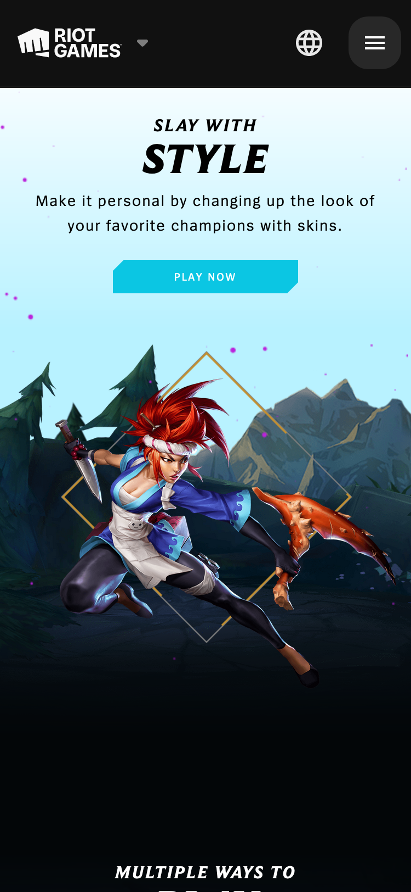

# Procesverslag
Markdown is een simpele manier om HTML te schrijven.  
Markdown cheat cheet: [Hulp bij het schrijven van Markdown](https://github.com/adam-p/markdown-here/wiki/Markdown-Cheatsheet).

Nb. De standaardstructuur en de spartaanse opmaak van de README.md zijn helemaal prima. Het gaat om de inhoud van je procesverslag. Besteedt de tijd voor pracht en praal aan je website.

Nb. Door *open* toe te voegen aan een *details* element kun je deze standaard open zetten. Fijn om dat steeds voor de relevante stuk(ken) te doen.

## Jij

  
uitwerken voor kick-off werkgroep

  ### Auteur:
  Morpheus Seedo

  #### Je startniveau:
  Rood

  #### Je focus:
  Surface Plane
 

## Je website

  
uitwerken voor kick-off werkgroep

  ### Je opdracht:
  Naam Website: League Of Legends
  
  Link: https://www.leagueoflegends.com/en-gb/ 

  #### Screenshot(s) van de eerste pagina (small screen): 
  
  Homepagina  
  

  #### Screenshot(s) van de tweede pagina (small screen):
  hier de naam van de pagina  
  
 

## Toegankelijkheidstest 1/2 (week 1)

  
uitwerken na test in 1e werkgroep

  ### Bevindingen
  Waar ik achter ben gekomen tijdens de toegankelijkheidstest waren:
    1. Dat de screen reader niet alleen een heel scherm van boven naar beneden (kunnen) lezen, maar ook alleen specifieke onderdelen op een wesbite.
    2. Dat het belangrijk is om rekening te houden met kleurgebruik voor mensen die visueel beperkt zijn;
    3. Dat het belangrijk dat de gebruiker gemakkelijk door de wesbite moet kunnen navigeren met alleen een toetsenbord.

  #### Screenreader
  De hiërarchie van de website van League of Legends is zeer goed, de screenreader leest eerst de belangrijkste onderdelen in gaat daarna op een chronologische wijze door de website heen.

  #### Muis en Toetsenbord 
  De wesbite valt goed te bedienen met alleen een toetsenbord.
  Wat hieraan verbeterd kan worden is de focusstate van de website, deze valt namelijk niet erg op een dat zou opvallender kunnen zijn i.v.m. toegankelijkheid. 

  #### Motoriek (shocks, elastiekjes)
  De website voel gemakkelijk te bedienen toen ik de elastiekjes om had, het enige waar ik op moest letten was dat ik niet met twee vingers tegelijk het scherm in drukte. 
  Dat heeft eerder te maken met de instellingen van mijn mac. 

  Het werd iets lastiger toen ik wilde navigeren door de website terwijl ik de schokband om had. 
  De oplossing die ik hiervoor zou kunnen bedenken zijn grotere buttons op de website, zodat er niet te veel mogleijkheden zijn om er naast te klikken.

  #### Visueel (brillen, contrast, kleurenblind, dark/light). 
  De wesbite van League of Legends valt goed te navigeren voor iemand met een visuele beperking.
  Het enige wat verbeterd zou kunnen worden zijn achtergrond afbeeldingen, deze vallen namelijk weg vanwege de lage hoeveelheid contrast.

## Breakdownschets (week 1)

  
uitwerken na afloop 2e werkgroep

  ### de hele pagina: 
  

## Voortgang 1 (week 2)

  
uitwerken voor 1e voortgang

  ### Agenda voor meeting
  samen met je groepje opstellen

  Donna          | 
  Vragen over de svg afbeeldingen van de social media op de website.

  Morpheus         |

‘Hoe kan ik meerdere img’s in een section selecteren, terwijl er zowel meerdere sections als img’s in dezelfde footer (maar wél apparte section en/of article) staan?’

  Ruby             |
  Klikbare bolletjes onder carousel 
  Werkbare filter knoppen bij items

  ### Verslag van meeting
 Donna had vragen over een automatische slider en hoe deze uit zichzelf kon laten bewegen en dat kon op diverse manieren. Doormiddel van JavaScript of gewoon met css en dan een timer erop zetten. Mijn vraag was ook beantwoord, ik kon namelijk achter de 'nth-of-type' gewoon een komma plaatsen en daarachter weer de code met de (andere) specifieke'nth-of-type' plaatsen en daarvan was ik niet op de hoogte.

## Voortgang 2 (week 3)

  
uitwerken voor 2e voortgang

  ### Stand van zaken
  Wat voor mij lastig is, is het achterhalen welke code gebruikt is om deze afbeeldingen op deze positie te krijgen.

    

  ### Agenda voor meeting
  samen met je groepje opstellen

   Donna          | 
    De vraag die Donna had was hoe zij de articles in haar section kon stijlen, de arcitle bestond uit een foto met daarin een titel en kleine tekst eronder. Terwijl het gehele afbeelding linkt naar een andere pagina.

  Morpheus         |

    ‘Ik heb vooral een vraag over de plaatsing van de afbeeldingen binnen een bepaalde section. Ik weet dat ik posistion absolute moet toepassen, maar als ik dat doe op één afbeelding, hoe kan ik er dan voor zorgen dat alle 3 de afbeeldingen geplaatst worden op dezelfde plek?'

  Ruby             |

    Ruby had een vraag over de verschillende hover (states) van de svg's die geplaatst waren op haar website

  ### Verslag van meeting
   De oplossing voor mijn probleem was vrij simpel, maar toen ondekte ik het moeilijkste gedeelde van mij code. Ik moest gaan werken met JavaScript om de source van de 3e afbeelding aan te passen na een x-aantal (mili)seconden.

## Toegankelijkheidstest 2/2 (week 4)

  
uitwerken na test in 8e werkgroep

  ### Bevindingen

  #### Screenreader
  Ik kwam erachter dat de screenreader alle elementen die ik toegepast heb op de website opleest in plaats van alleen de content en de alt tags.
  Hier zal ik een oplossing op kunnen bedenken om de website nog toegankelijker te maken voor de gebruiker.

  #### Muis en Toetsenbord 
  Ik kwam erachter dat het gemakkelijk is om met toetsebord en muis te navigeren door mijn website heen. Het puntje dat verbeterd moet worden is de focus state. De gebruiker kan namelijk niet zien waar hij zich nou bevindt op de webpagina (los van het scherm dat mee beweegt).

  #### Motoriek (shocks, elastiekjes)
  Hier was niet heel veel aan veranderd vergeleken met vorige keer. Ik heb echter de knoppen toegankelijker gemaakt door deze groter te maken.

  #### Visueel (brillen, contrast, kleurenblind, dark/light). 
  Ik kwam erachter dat het wellicht een handige oplossing zou zijn op het moment dat ik alleen maar zwarte of witte achtergronden gebruikte in plaats van foto's. Op deze manier is dit voor visueel beperkte meer overzichtelijk, minder afleidend en dus toegankelijker.

## Voortgang 3 (week 4)

  
uitwerken voor 3e voortgang

  ### Stand van zaken
  hier dit ging goed & dit was lastig (neem ook screenshots op van delen van je website en code)

  ### Agenda voor meeting
  samen met je groepje opstellen

   Donna          | 
  Donna had een vraag over de zoekfunctie, de zoekbalk en hoe ze een slider kon maken op haar tweede pagina.

  Morpheus         |
    De vraag dit ik op dit moment heb is hoe ik de mask image toe pas aangezien het niet de bedoeling is dat ik de image plaats in een mask, maar dat ik ervoor zorg dat de mask een transition effect is in plaats van een uitknipmasker.

  Ruby             |

    Ruby had een vraag over het maken van een klikbare carousel.

  ### Verslag van meeting
  De voortgang verliep goed en het was zeker handig om nieuwe dingen te leren over niet alleen de problemen waar ik zelf tegen aan liep, maar ook welke mijn medestudenten ervaarden.
  We hadden allemaal zowel antwoord als uitleg gekregen over de (mogelijke) oplossingen en hoe we deze konden toepassen.
  Het probleem waar ik tegenaan liep vond ik het meest complex omdat ik daar gebruik moest gaan maken van een clip path en keyframes.

## Eindgesprek (week 5)

  
uitwerken voor eindgesprek

  ### Je uitkomst - karakteristiek screenshots:
  

  

  ### Dit ging goed/Heb ik geleerd: 
  Op de championspagina was het gelukt zowel de champions (met bij behorende namen) in een respomsive kolom te plaatsen, als er een hover state aan toe te voegen waardoor dit het resulaat is geworden.

  

  ### Dit was lastig/Is niet gelukt:
  Wat mij helaas niet gelukd was, was de 5e section, dit was een slider met van alles dat gebeurde op de achtergrond. Door gebrek aan tijd door uitgelopen planningen lukte het mij helaas niet meer om dit onderdeel van de website op tijd te realiseren. Om die reden heb ik ervoor gekozen deze onzichtbaar te maken, zodat de kwaliteit van mijn oplevering er niet onder zou leiden.

  

## Bronnenlijst

  
continu bijhouden terwijl je werkt

  Nb. Wees specifiek ('css-tricks' als bron is bijv. niet specifiek genoeg).

  1. W3schools: Import fonts, video's, positionering.
  2. Studenten assistent: Danian: Flexboxes, fonts, header/footer video plaatsing, champions op champion page,  borders om de articles, de reset CSS code & positionering nav.
  3. Studenten assistent: Bram:  vereenvoudigen code, positionering main section 3: Akali skins
  4. Studenten assistent: Soundos: main section 3: Akali skins, script
  5. Sanne 't Hooft: main section 2: choose your character

